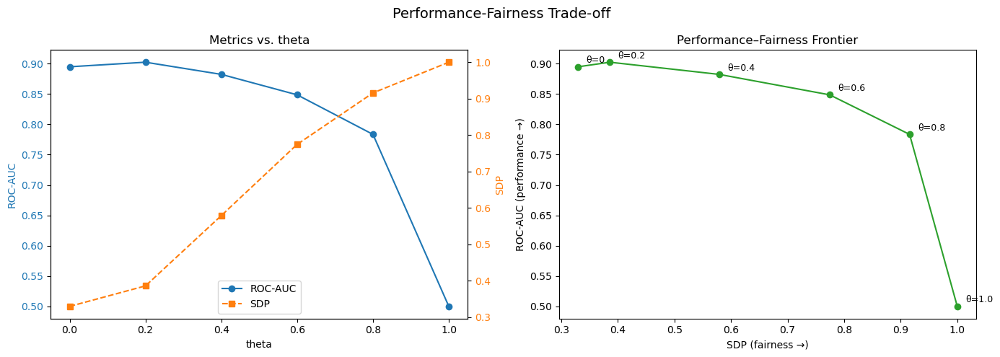

# fair-trees

This package is the implementation of the paper [**"Fair tree classifier using strong demographic parity"**](https://link.springer.com/article/10.1007/s10994-023-06376-z) (Pereira Barata et al., *Machine Learning*, 2023).

It provides fairness-aware decision tree and random forest classifiers built on a modified scikit-learn tree engine. The splitting criterion jointly optimises predictive performance and statistical parity with respect to one or more sensitive (protected) attributes **Z**.

## Installation

```bash
pip install fair-trees
```

Or from source:

```bash
pip install -e . --no-build-isolation
```

## Quick start

```python
import numpy as np
import pandas as pd
from fair_trees import FairDecisionTreeClassifier, FairRandomForestClassifier, load_datasets

datasets = load_datasets()
data = datasets["bank_marketing"]   # "adult" is also available

# Preprocessing — the bundled data contains raw DataFrames
X = pd.get_dummies(data["X"]).values.astype(np.float64)
y = pd.factorize(data["y"].iloc[:, 0])[0]
Z = np.column_stack([pd.factorize(data["Z"][col])[0] for col in data["Z"].columns])
```

### Fairness-aware decision tree

```python
clf = FairDecisionTreeClassifier(
    theta=0.3,          # trade-off: 0 = pure accuracy, 1 = pure fairness
    Z_agg="max",        # how to aggregate across sensitive attributes / classes
    max_depth=5,
)
clf.fit(X, y, Z=Z)

y_prob = clf.predict_proba(X)[:, 1]
```

### Fairness-aware random forest

```python
rf = FairRandomForestClassifier(
    n_estimators=100,
    theta=0.3,
    Z_agg="max",
    max_depth=5,
    random_state=42,
)
rf.fit(X, y, Z=Z)

y_prob = rf.predict_proba(X)[:, 1]
```

## Evaluation

The package does not ship its own metric functions, but the two scores that
matter—**ROC-AUC** (predictive quality) and **SDP** (statistical
parity)—can be computed from `scipy` in a few lines.

### ROC-AUC via the Mann–Whitney U statistic

```python
from scipy.stats import mannwhitneyu

roc_auc = mannwhitneyu(
    y_prob[y == 1],
    y_prob[y == 0],
).statistic / (sum(y == 1) * sum(y == 0))

print(f"ROC-AUC: {roc_auc:.4f}")
```

### Statistical Disparity (SDP) score

SDP measures how well the model's predictions are separated by a protected
attribute. It is defined as:

```
SDP = 1 − |AUC_Z − 0.5| × 2
```

where `AUC_Z` is computed the same way as ROC-AUC but treating each
sensitive attribute/class in **Z** as the positive label.

When **Z** contains multiple columns (attributes) and/or more than two
classes per attribute, the per-group AUC values must be aggregated.  The
`Z_agg` parameter controls this—matching the logic used inside the
splitting criterion:

| `Z_agg`  | Behaviour |
|----------|-----------|
| `"mean"` | Average the per-group SDP scores (across classes within an attribute, then across attributes). |
| `"max"`  | Take the **worst-case** (lowest) SDP across all groups—i.e. the group with the highest disparity dominates. |

```python
import numpy as np
from scipy.stats import mannwhitneyu


def sdp_score(y_prob, Z, Z_agg="max"):
    """Compute the Statistical Disparity (SDP) score.

    Parameters
    ----------
    y_prob : array-like of shape (n_samples,)
        Predicted probabilities for the positive class.
    Z : array-like of shape (n_samples,) or (n_samples, n_attributes)
        Sensitive / protected attribute(s).  Each column is treated as a
        separate attribute; each unique value within a column is a class.
    Z_agg : {"mean", "max"}, default="max"
        Aggregation method across attributes and classes.
        - "mean": average SDP across all groups.
        - "max":  return the worst-case (lowest) SDP.

    Returns
    -------
    float
        SDP in [0, 1].  1 = perfect parity, 0 = maximum disparity.
    """
    Z = np.atleast_2d(np.asarray(Z).T).T          # ensure (n_samples, n_attr)
    y_prob = np.asarray(y_prob)
    sdp_values = []

    for attr_idx in range(Z.shape[1]):
        z_col = Z[:, attr_idx]
        classes = np.unique(z_col)
        attr_sdps = []

        for cls in classes:
            mask_pos = z_col == cls
            mask_neg = ~mask_pos
            if mask_pos.sum() == 0 or mask_neg.sum() == 0:
                continue
            auc_z = mannwhitneyu(
                y_prob[mask_pos],
                y_prob[mask_neg],
            ).statistic / (mask_pos.sum() * mask_neg.sum())
            attr_sdps.append(1 - abs(auc_z - 0.5) * 2)

        if not attr_sdps:
            continue

        if Z_agg == "mean":
            sdp_values.append(np.mean(attr_sdps))
        else:  # "max" → worst case = minimum SDP
            sdp_values.append(np.min(attr_sdps))

    if not sdp_values:
        return 1.0  # no disparity measurable

    if Z_agg == "mean":
        return float(np.mean(sdp_values))
    else:
        return float(np.min(sdp_values))
```

### Putting it all together

```python
import numpy as np
import pandas as pd
import matplotlib.pyplot as plt
from scipy.stats import mannwhitneyu
from fair_trees import FairRandomForestClassifier, load_datasets

# Load and preprocess
datasets = load_datasets()
data = datasets["bank_marketing"]

X = pd.get_dummies(data["X"]).values.astype(np.float64)
y = pd.factorize(data["y"].iloc[:, 0])[0]
Z = np.column_stack([pd.factorize(data["Z"][col])[0] for col in data["Z"].columns])

# Sweep over theta values
thetas = [0, 0.2, 0.4, 0.6, 0.8, 1.0]
aucs, sdps = [], []

for theta in thetas:
    rf = FairRandomForestClassifier(
        n_estimators=100, theta=theta, Z_agg="max", max_depth=5, random_state=42,
    )
    rf.fit(X, y, Z=Z)
    y_prob = rf.predict_proba(X)[:, 1]

    roc_auc = mannwhitneyu(
        y_prob[y == 1], y_prob[y == 0],
    ).statistic / (sum(y == 1) * sum(y == 0))

    sdp = sdp_score(y_prob, Z, Z_agg="max")

    aucs.append(roc_auc)
    sdps.append(sdp)
    print(f"theta={theta:.1f}  ROC-AUC={roc_auc:.4f}  SDP={sdp:.4f}")

# Plot
fig, (ax1, ax3) = plt.subplots(1, 2, figsize=(14, 5))

# Left — Metrics vs. theta (dual axis)
ax1.set_xlabel("theta")
ax1.set_ylabel("ROC-AUC", color="tab:blue")
ax1.plot(thetas, aucs, "o-", color="tab:blue", label="ROC-AUC")
ax1.tick_params(axis="y", labelcolor="tab:blue")

ax2 = ax1.twinx()
ax2.set_ylabel("SDP", color="tab:orange")
ax2.plot(thetas, sdps, "s--", color="tab:orange", label="SDP")
ax2.tick_params(axis="y", labelcolor="tab:orange")

ax1.set_title("Metrics vs. theta")
lines1, labels1 = ax1.get_legend_handles_labels()
lines2, labels2 = ax2.get_legend_handles_labels()
ax1.legend(lines1 + lines2, labels1 + labels2, loc="lower center")

# Right — ROC-AUC vs. SDP frontier
ax3.plot(sdps, aucs, "o-", color="tab:green")
for i, theta in enumerate(thetas):
    ax3.annotate(f"θ={theta}", (sdps[i], aucs[i]), textcoords="offset points",
                 xytext=(8, 4), fontsize=9)
ax3.set_xlabel("SDP (fairness →)")
ax3.set_ylabel("ROC-AUC (performance →)")
ax3.set_title("Performance–Fairness Frontier")

fig.suptitle("Performance-Fairness Trade-off", fontsize=14)
fig.tight_layout()
plt.savefig("tradeoff.png", dpi=150, bbox_inches="tight")
plt.show()
```



## Key parameters

| Parameter | Default | Description |
|-----------|---------|-------------|
| `theta`   | `0.0`   | Trade-off weight in `[0, 1]`. `0` = standard (unfair) tree; `1` = splits optimise only for fairness. |
| `Z_agg`   | `"max"` | Aggregation over sensitive groups: `"mean"` (average) or `"max"` (worst-case). |
| `Z`       | `None`  | Sensitive attributes, passed to `.fit()`. Array of shape `(n_samples,)` or `(n_samples, n_attributes)`. |

All other parameters (`max_depth`, `min_samples_split`, `n_estimators`,
etc.) behave identically to their scikit-learn counterparts.

## Citation

If you use this software, please cite the paper:

> Pereira Barata, A., Takes, F.W., van den Herik, H.J., & Veenman, C. (2023). **Fair tree classifier using strong demographic parity.** *Machine Learning*. [doi:10.1007/s10994-023-06376-z](https://doi.org/10.1007/s10994-023-06376-z)

See [`CITATION.cff`](CITATION.cff) for a machine-readable citation file.

## License

BSD-3-Clause
